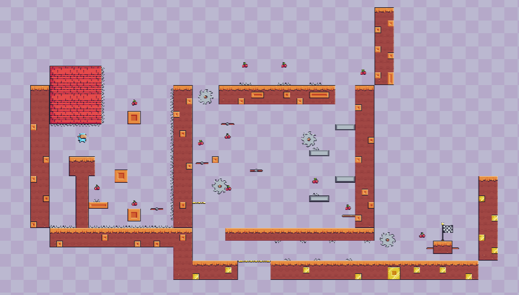
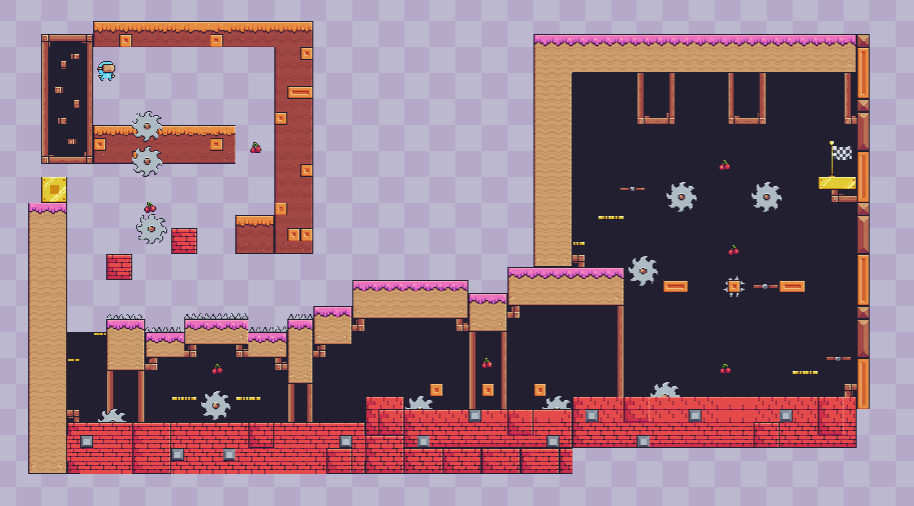

# 🎮 2D Platformer Game - Unity

Bu proje, Unity ile geliştirilen 2D platform oyunudur.
Oyuncu, zıplayarak ve engellerden kaçarak seviyeleri geçmeye çalışır. 
Toplanabilir nesneler, seviye ilerleme sistemi ve kullanıcı dostu arayüz içerir.

## 📌 Özellikler

- 👾 Haraketli Platformlar ve Haraketli Testerelerden kaçış
- 🧭 Seviye ilerleme sistemi
- 🍓 Toplanabilir nesneler (örn. çilek)
- 💾 Oyuncu ilerlemesi kaydedilir
- 🎮 Basit ve sezgisel kontroller

## 🖼️ Ekran Görüntüleri

### Ana Menü

### Levels

## 🚧 Yol Haritası

- [x] Seviye geçiş sistemi
- [x] Toplanabilir nesneler
- [ ] Double Jump ve Wall grab mechanic
- [ ] Mobil desteği

---

## 👨‍💻 Geliştirici

- **İsim:** Bahadır Sandıkcı
- **İletişim:** baho842@hotmail.com
- **LinkedIn / GitHub:** https://github.com/ZetySama  /  www.linkedin.com/in/bahadır-sandıkcı-003a86287

---

## 📝 Lisans

Bu proje, kişisel ve eğitim amaçlı kullanım içindir. Kodları referans göstererek kullanabilirsiniz.

---

